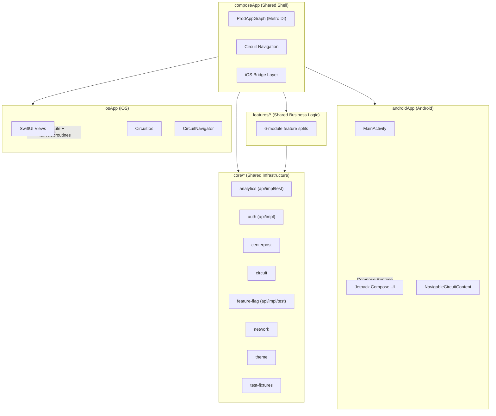
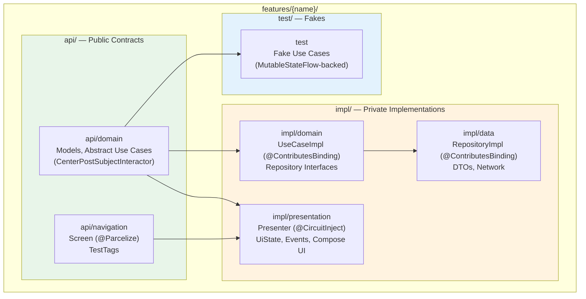
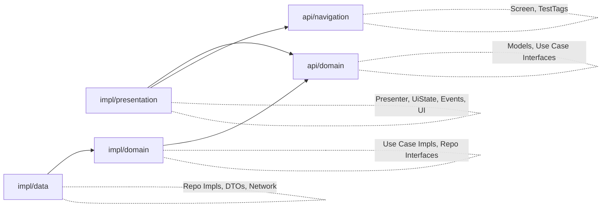

# Architecture Reference

## High-Level Architecture Overview



```
                    ┌─────────────────────────────────────┐
                    │            composeApp               │
                    │  ProdAppGraph (Metro DI) + Circuit   │
                    │  Wires all feature modules together  │
                    └──────────┬──────────┬───────────────┘
                 Android       │          │          iOS
              ┌────────────────┘          └──────────────────┐
              │                                              │
     ┌────────▼────────┐                          ┌─────────▼─────────┐
     │   androidApp    │                          │      iosApp       │
     │   MainActivity  │                          │  SwiftUI Views    │
     │   Compose UI    │                          │  Circuit bridge   │
     └─────────────────┘                          └───────────────────┘
```

## Project Structure

```
MockDonalds/
├── androidApp/                         # Android application entry point
│   └── src/main/kotlin/
│       ├── MainActivity.kt             # Sets content to App()
│       └── MockDonaldsApplication.kt   # Application class
│
├── composeApp/                         # Shared application module
│   └── src/
│       ├── commonMain/kotlin/
│       │   ├── AppGraph.kt             # ProdAppGraph — extends AppGraph (core:metro)
│       │   ├── MockDonaldsBottomNavigation.kt
│       │   └── MockDonaldsIcons.kt
│       ├── androidMain/kotlin/
│       │   └── App.kt                  # NavigableCircuitContent + predictive back
│       └── iosMain/kotlin/
│           └── bridge/
│               ├── IosApp.kt           # Metro graph, presenterBridge() + BridgeNavigator
│               ├── BridgeNavigator.kt  # Navigator impl → Channel<NavigationAction> for iOS
│               ├── NavigationAction.kt # Sealed class — GoTo, Pop, ResetRoot, SwitchTab
│               └── CircuitPresenterKotlinBridge.kt  # Molecule + NativeCoroutines bridge
│
├── core/
│   ├── auth/
│   │   ├── api/                        # AuthManager interface (public contract)
│   │   └── impl/                       # InMemoryAuthManager (private implementation)
│   ├── centerpost/                     # Business logic framework (interactors, result types)
│   ├── circuit/                        # Shared Circuit types (TabScreen, ProtectedScreen, CircuitProviders)
│   ├── metro/                          # AppGraph interface (DI contract)
│   ├── network/                        # HTTP client (Ktor)
│   ├── test-fixtures/                  # TestCenterPostDispatchers, KotestProjectConfig, StateRobot
│   └── theme/                          # Design system (Colors, Theme, Dimens, Typography)
│
├── features/
│   ├── home/                           # Each feature follows the 6-module structure below
│   ├── login/
│   ├── order/
│   ├── rewards/
│   ├── scan/
│   └── more/
│
├── testing/architecture-check/                     # Architecture enforcement (Konsist test suite)
│
├── iosApp/                             # iOS application (Xcode project)
│   └── iosApp/
│       ├── Circuit/                    # CircuitIos, CircuitView, CircuitContent, CircuitNavigator
│       ├── Theme/                      # MockDonaldsTheme (light/dark colors, dimens)
│       ├── Features/                   # SwiftUI views per feature
│       ├── MockDonaldsApp.swift        # Tab bar + CircuitNavigator
│       └── AppDelegate.swift           # ScreenUiFactory registration
│
└── build-logic/convention/             # Gradle convention plugins
    └── src/main/kotlin/
        ├── mockdonalds.kmp.library.gradle.kts       # Base KMP (api modules)
        ├── mockdonalds.kmp.domain.gradle.kts        # KMP + Metro
        ├── mockdonalds.kmp.data.gradle.kts          # KMP + Metro + Serialization
        └── mockdonalds.kmp.presentation.gradle.kts  # KMP + Compose + Metro + Circuit codegen
```

## Layer Dependency Rules

Unidirectional dependency flow, enforced by Konsist (`LayerDependencyTest`):

```
api/domain  <--  impl/domain  <--  impl/data
api/navigation  <--  impl/presentation
api/domain  <--  impl/presentation
```

Forbidden directions:
- api must NOT import from sibling domain, data, or presentation
- impl/domain must NOT import from data or presentation
- impl/data must NOT import from presentation
- impl/presentation must NOT import from impl/data or impl/domain

### Why Each Isolation Rule Exists

| Rule | Rationale |
|------|-----------|
| api has zero impl imports | api modules are the public contract; they must compile independently so consumers never transitively pull in implementation details |
| presentation cannot see data | Forces all data access through domain interactors, keeping UI testable with fakes and preventing tight coupling to network/storage |
| domain cannot see presentation | Domain logic is platform-agnostic; importing UI types would break shared KMP compilation and violate separation of concerns |
| data cannot see presentation | Data layer is a pure I/O boundary; it should never react to UI state or depend on UI frameworks |
| impl modules are private | Enables parallel Gradle builds (no cross-impl edges), allows teams to refactor internals without breaking other modules |

## Feature Module Layout (6 Submodules)

Each feature under `features/{name}/` contains exactly 6 submodules, organized into three top-level directories (`api/`, `impl/`, `test/`) that make the architecture self-documenting:



```
┌──────────────────────────────────────────────────────────────────────────┐
│                           Feature Module                                 │
│                                                                          │
│  ┌─────────────┐  ┌─────────────┐                                       │
│  │ api/domain  │  │api/navigation│   ◄── Public contracts (api/)        │
│  │             │  │             │                                        │
│  │ Models      │  │ Screen      │                                        │
│  │ UseCase     │  │ TestTags    │                                        │
│  │ Interface   │  │ (@Parcelize)│                                        │
│  └──────▲──────┘  └──────▲──────┘                                        │
│         │                │                                               │
│  ┌──────┴──────┐         │         ┌──────────┐    ┌──────────────────┐  │
│  │ impl/domain │         │         │impl/data │    │impl/presentation │  │
│  │             │         │         │          │    │                  │  │
│  │ UseCase Impl│         │         │ Repo Impl│    │ Presenter        │  │
│  │ Repo Iface  │         │         │          │    │ UiState/Events   │  │
│  └──────▲──────┘         │         └──────────┘    │ UI (Android)     │  │
│         │                │              │          └────────┬─────────┘  │
│         └── impl/data ───┘              │                   │            │
│                                         │                   │            │
│    impl/presentation depends on api/domain + api/navigation only         │
└──────────────────────────────────────────────────────────────────────────┘
```

### Dependency Flow Diagram



```
impl/presentation ──► api/domain ◄── impl/domain ◄── impl/data
       │                  │               │
       │                  │               ├── Use case implementations
       │                  │               └── Repository interfaces
       │                  ├── Domain models
       │                  └── Use case interfaces
       │
       └──────────────► api/navigation
                           ├── Screen definitions
                           └── TestTags
```

Key constraints:
- **impl/presentation depends only on api submodules** — it never sees impl/domain or impl/data
- **impl/domain depends only on api/domain** — no Circuit dependency, pure business logic
- **Cross-feature navigation** depends on `<other>:api:navigation` only

| Submodule | Responsibility | Plugin |
|-----------|---------------|--------|
| `api/domain` | Public models, abstract use cases (`CenterPostSubjectInteractor` subclasses) | `mockdonalds.kmp.library` |
| `api/navigation` | Screen objects (`@Parcelize data object`), TestTags | `mockdonalds.kmp.library` |
| `impl/domain` | UseCaseImpl classes, Repository interfaces | `mockdonalds.kmp.domain` |
| `impl/data` | RepositoryImpl classes, DTOs, network/storage calls | `mockdonalds.kmp.data` |
| `impl/presentation` | Presenter functions, UiState, Events, Compose UI | `mockdonalds.kmp.presentation` |
| `test` | Fakes extending abstract use cases for testing | `mockdonalds.kmp.domain` |

## Cross-Feature Import Rules

Cross-feature imports are ONLY permitted through `api/` modules. Enforced by `LayerDependencyTest`.

Correct:
```kotlin
// In features/order/impl/presentation/
import com.mockdonalds.app.features.home.api.navigation.HomeScreen  // api module -- allowed
import com.mockdonalds.app.features.login.api.domain.AuthStatus     // api module -- allowed
```

Incorrect:
```kotlin
// In features/order/impl/presentation/
import com.mockdonalds.app.features.home.domain.HomeRepository      // impl/domain -- FORBIDDEN
import com.mockdonalds.app.features.home.data.HomeRepositoryImpl    // impl/data -- FORBIDDEN
import com.mockdonalds.app.features.home.presentation.HomeUiState   // impl/presentation -- FORBIDDEN
```

## Core Module Isolation

Core modules (`core/*`) must NEVER import from feature modules (`features/*`). This ensures core remains a stable foundation that all features depend on without circular dependencies. Enforced by `LayerDependencyTest` ("core modules should not import from feature modules").

## Core Module Consumption Patterns

**Rule: Presenters always use CenterPost interactors. Domain/data always use the provider interface directly.** This applies to all core modules with api/impl — no exceptions.

| Core Module | Presenter Layer | Domain/Data Layer |
|-------------|----------------|-------------------|
| `core:feature-flag` | `ObserveFeatureFlag` (CenterPostSubjectInteractor) | `FeatureFlagProvider` (interface) |
| `core:analytics` | `TrackAnalyticsEvent` (CenterPostInteractor) | `AnalyticsDispatcher` (interface) |

For fire-and-forget interactors (analytics), the `inProgress` loading state goes uncollected — zero overhead. The value: structured execution, error handling, timeout protection, dispatcher correctness. Keeping the rule absolute means no exceptions to remember.

Note: `core:auth` currently exposes only `AuthManager` (interface) with no interactor — auth is consumed by `AuthInterceptor` (infrastructure in composeApp), not by presenters directly. If presenters need auth state reactively in the future, an interactor should be added.

## Convention Plugin Mapping

| Plugin | Module Type | What It Adds |
|--------|------------|-------------|
| `mockdonalds.kmp.library` | api/*, core/* | Base KMP (Android SDK 36/min 26, iOS targets, JVM 17), Parcelize, KSP, Kotest, Detekt, auto `:core:test-fixtures` in commonTest |
| `mockdonalds.kmp.domain` | impl/domain | Everything in library + Metro DI (`@ContributesBinding` support) |
| `mockdonalds.kmp.data` | impl/data | Everything in library + Metro DI + kotlinx.serialization |
| `mockdonalds.kmp.presentation` | impl/presentation | Everything in library + Compose Multiplatform + Compose Compiler + Metro DI with Circuit codegen (`enableCircuitCodegen`), Circuit dependencies, Material3, Coil, androidDeviceTest support |
| `mockdonalds.detekt` | (transitive via library) | Detekt with `config/detekt/detekt.yml`, parallel execution, auto-correct, formatting plugin |

## Gradle Module Wiring

### Auto-Discovery in settings.gradle.kts

Feature modules are auto-discovered via filesystem traversal -- no manual `include()` statements per feature:

```kotlin
rootDir.resolve("features").listFiles()
    ?.filter { it.isDirectory }
    ?.map { it.name }
    ?.sorted()
    ?.forEach { feature ->
        include(":features:$feature:api:domain")
        include(":features:$feature:api:navigation")
        include(":features:$feature:impl:data")
        include(":features:$feature:impl:domain")
        include(":features:$feature:impl:presentation")
        include(":features:$feature:test")
    }
```

Adding a new feature directory under `features/` automatically includes all 6 submodules.

### composeApp Dependency Loop

`composeApp/build.gradle.kts` uses the same filesystem scan to wire all features into the app shell:

- `api(project(":features:$feature:api:domain"))` -- models visible to iOS framework
- `api(project(":features:$feature:api:navigation"))` -- screens visible to iOS framework
- `implementation(project(":features:$feature:impl:data"))` -- private, not exported
- `implementation(project(":features:$feature:impl:domain"))` -- private, not exported
- `api(project(":features:$feature:impl:presentation"))` -- exported for iOS framework

iOS framework export loop separately exports `api:domain`, `api:navigation`, and `impl:presentation` for each feature, plus `:core:circuit`.

## Module Boundary Enforcement via Konsist

Konsist tests (run via `./gradlew :testing:architecture-check:test`) enforce all architectural boundaries:

| Test Class | What It Enforces |
|-----------|-----------------|
| `LayerDependencyTest` | api isolation, domain/data/presentation unidirectional flow, cross-feature api-only imports, core never imports features |
| `ForbiddenPatternsTest` | No ViewModels, no raw CoroutineScope/launch/async in features, no hardcoded Dispatchers, no Android platform imports in commonMain, app module isolation |
| `CircularDependencyTest` | No circular dependency chains between modules |
| `PresentationLayerTest` | Presenters must not depend on repositories, must not construct api domain models, single public function per presenter file |
| `CircuitConventionsTest` | Events must be sealed class (not interface), Screens in api/navigation with @Parcelize, ProtectedScreen in api/navigation |
| `ApiLayerTest` | api module purity rules |
| `DomainLayerTest` | Domain layer conventions |
| `DataLayerTest` | Data layer conventions |
