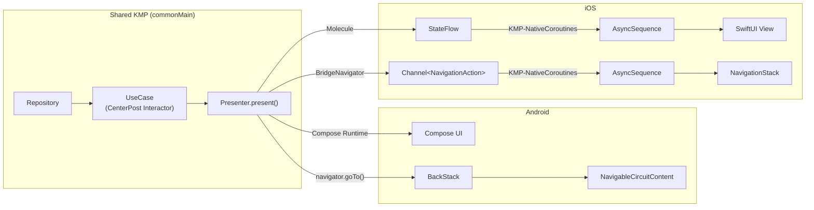
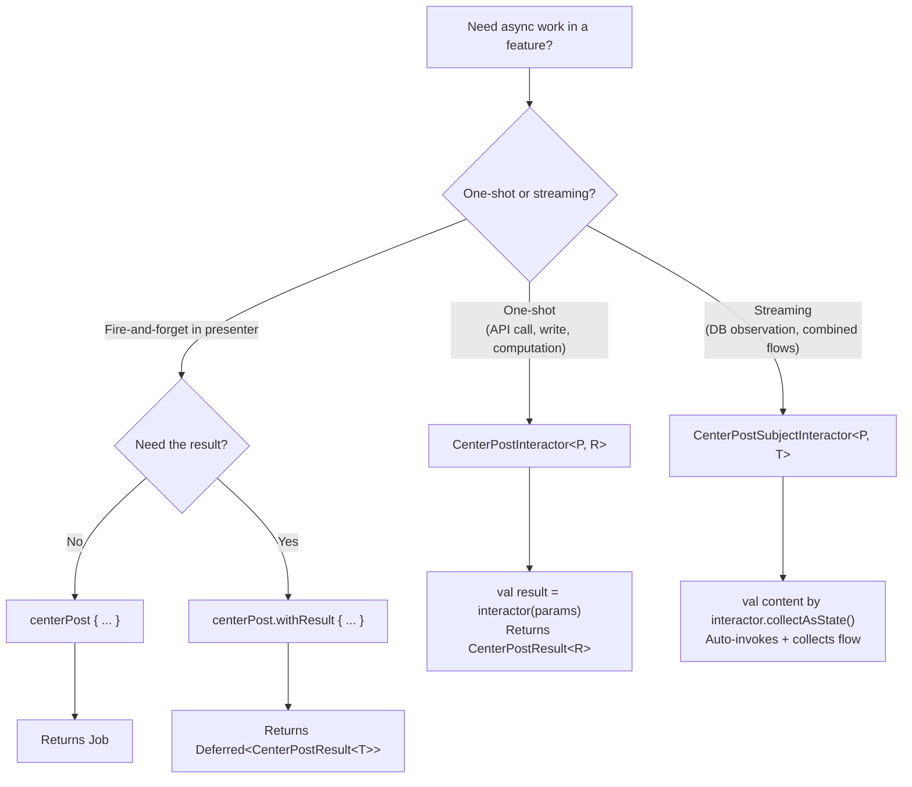
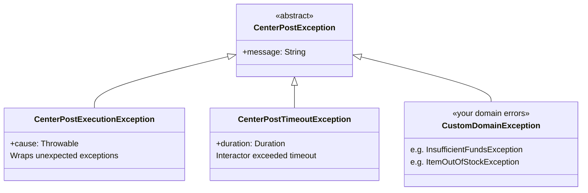
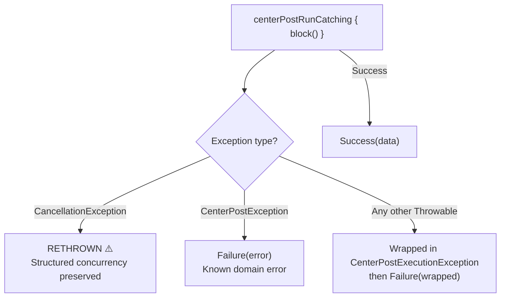

# CenterPost Consumer Guide

How features USE the CenterPost framework. For API internals, see `core/centerpost/AGENTS.md`. For how interactors are bound into the Metro graph and injected into presenters, see [dependency-injection.md](dependency-injection.md).

## Framework Philosophy

CenterPost provides structured coroutines for ALL business logic. Features never use raw `CoroutineScope`, `launch`, `async`, or hardcoded `Dispatchers.*`. CenterPost wraps coroutine execution with error handling, timeout management, and loading state tracking.

## Platform Data Flow

Shows how data flows from repositories through CenterPost interactors to platform-native UI:



```
Android:
  State: Repository ──► UseCase ──► Presenter.present() ──[Compose Runtime]──► Compose UI
  Nav:   Presenter ──► navigator.goTo() ──► BackStack ──► NavigableCircuitContent

iOS:
  State: Repository ──► UseCase ──► Presenter.present() ──[Molecule]──► StateFlow
                                                          ──[KMP-NativeCoroutines]──► AsyncSequence
                                                          ──► SwiftUI View
  Nav:   Presenter ──► BridgeNavigator ──► Channel<NavigationAction>
                                          ──[KMP-NativeCoroutines]──► CircuitNavigator
                                          ──► NavigationStack
```

## Type Decision Flowchart



## CenterPostInteractor<P, R> -- One-Shot Operations

For suspend operations that run once and return a result (API calls, writes, computations).

```kotlin
class PlaceOrderInteractor @Inject constructor(
    private val repo: OrderRepository,
) : CenterPostInteractor<OrderParams, OrderConfirmation>() {
    override suspend fun doWork(params: OrderParams) = repo.placeOrder(params)
}
```

Key properties:
- `inProgress: Flow<Boolean>` -- loading state with debounce (5s for ambient, instant for user-initiated)
- Default timeout: 5 minutes (configurable per call)
- Returns `CenterPostResult<R>` (never throws, except `CancellationException`)

Invocation:
```kotlin
val result = placeOrderInteractor(orderParams)                    // with params
val result = placeOrderInteractor(orderParams, timeout = 30.seconds) // custom timeout
val result = getMenuInteractor()                                  // Unit params shorthand
```

## CenterPostSubjectInteractor<P, T> -- Streaming Operations

For observable data that changes over time (database queries, real-time updates, combined flows).

```kotlin
class GetHomeContent @Inject constructor() : CenterPostSubjectInteractor<Unit, HomeContent>() {
    // Abstract -- impl in domain module
    abstract override fun createObservable(params: Unit): Flow<HomeContent>
}

// Implementation in impl/domain:
@ContributesBinding(AppScope::class)
class GetHomeContentImpl(
    private val repository: HomeRepository,
) : GetHomeContent() {
    override fun createObservable(params: Unit): Flow<HomeContent> {
        return combine(
            repository.getUserName(),
            repository.getHeroPromotion(),
            repository.getRecentCravings(),
            repository.getExploreItems(),
        ) { userName, hero, cravings, explore ->
            HomeContent(userName = userName, heroPromotion = hero, recentCravings = cravings, exploreItems = explore)
        }
    }
}
```

Internal behavior: params go through `distinctUntilChanged()` then `flatMapLatest { createObservable(it) }` then another `distinctUntilChanged()`. This means new params cancel the previous observable, and duplicate emissions are suppressed.

## When to Use Which

| Use Case | Type | Examples |
|----------|------|----------|
| One-shot | `CenterPostInteractor` | API calls, place order, login, write operations |
| Streaming | `CenterPostSubjectInteractor` | Database observation, combined content flows, real-time data |

## CenterPostResult<T>

Sealed interface: `Success(data)` / `Failure(error: CenterPostException)`.

Full API:
```kotlin
result.onSuccess { data -> /* use data */ }          // chain: returns self
result.onFailure { error -> /* handle error */ }     // chain: returns self
result.map { data -> transform(data) }               // Success -> Success(transformed), Failure -> Failure
result.flatMap { data -> anotherResult(data) }        // Success -> new result, Failure -> Failure
result.fold(onSuccess = { ... }, onFailure = { ... }) // extract value from either branch
result.getOrNull()                                    // T? -- null on failure
result.getOrDefault(fallback)                         // T -- fallback on failure
result.getOrElse { error -> computeFallback(error) }  // T -- compute on failure
result.recover { error -> tryAlternative(error) }     // suspend: Failure -> try recovery
```

## CenterPost Launcher

Compose-scoped coroutine launcher for fire-and-forget or deferred operations in presenters.

```kotlin
val centerPost = rememberCenterPost(dispatchers)

// Fire-and-forget (returns Job):
centerPost { repo.syncData() }

// With result (returns Deferred<CenterPostResult<T>>):
val deferred = centerPost.withResult { repo.fetchSomething() }
```

`rememberCenterPost()` scopes the `CenterPost` to the composition lifecycle. It uses `dispatchers.default` as the coroutine context.

## centerPostRunCatching()

Like `runCatching` but critically different:
- **Rethrows `CancellationException`** -- structured concurrency requires cancellation to propagate
- Wraps known `CenterPostException` as `Failure`
- Wraps unexpected `Throwable` in `CenterPostExecutionException` then `Failure`

Never use stdlib `runCatching` in CenterPost contexts -- it swallows cancellation.

## Error Handling

### Exception Hierarchy



```
CenterPostException (abstract)
  +-- CenterPostExecutionException   -- wraps unexpected Throwable
  +-- CenterPostTimeoutException     -- interactor exceeded timeout (carries Duration)
  +-- (your custom domain exceptions)
```

### Exception Classification by centerPostRunCatching



### Custom Domain Exceptions

Extend `CenterPostException` for domain-specific errors:
```kotlin
class InsufficientFundsException(
    val balance: Double,
) : CenterPostException("Insufficient funds: balance=$balance")
```

### Recovery Pattern

```kotlin
val result = placeOrderInteractor(params)
    .recover { error ->
        when (error) {
            is CenterPostTimeoutException -> retryInteractor(params)
            else -> CenterPostResult.Failure(error)
        }
    }
```

### Never Catch CancellationException

`centerPostRunCatching` handles this correctly. Manual `try/catch` blocks must rethrow it:
```kotlin
// WRONG: catch(e: Exception) { ... }  -- swallows cancellation
// RIGHT: centerPostRunCatching { ... } -- rethrows CancellationException automatically
```

## CenterPostDispatchers and TestCenterPostDispatchers

```kotlin
interface CenterPostDispatchers {
    val default: CoroutineDispatcher
    val io: CoroutineDispatcher
    val main: CoroutineDispatcher
}
```

- Production: `DefaultCenterPostDispatchers` (bound via `@ContributesBinding`) uses real `Dispatchers.*`
- Tests: `TestCenterPostDispatchers()` routes all three to a single `StandardTestDispatcher` for deterministic execution

Presenters inject `CenterPostDispatchers` (the interface), making them testable.

## Complete Presenter Integration Example

Streaming content + one-shot event handling together:

```kotlin
@CircuitInject(HomeScreen::class, AppScope::class)
@Inject
@Composable
fun HomePresenter(
    navigator: Navigator,
    getHomeContent: GetHomeContent,         // streaming interactor (abstract)
    dispatchers: CenterPostDispatchers,
): HomeUiState {
    val centerPost = rememberCenterPost(dispatchers)
    val content by getHomeContent.collectAsState()  // auto-invokes with Unit, collects flow

    return HomeUiState(
        userName = content?.userName ?: "",
        heroPromotion = content?.heroPromotion,
        recentCravings = content?.recentCravings ?: emptyList(),
        exploreItems = content?.exploreItems ?: emptyList(),
        eventSink = { event ->
            when (event) {
                is HomeEvent.HeroCtaClicked -> centerPost { /* one-shot via launcher */ }
                is HomeEvent.CravingClicked -> centerPost { /* ... */ }
                is HomeEvent.ExploreItemClicked -> centerPost { /* ... */ }
            }
        },
    )
}
```

## Core Module Interactor Guidance

All core modules with api/impl MUST expose CenterPost interactors for presenter consumption. This rule is absolute — even fire-and-forget operations go through interactors from presenters.

**Choose the interactor type based on the operation:**

| Operation Type | Interactor | Example |
|---------------|-----------|---------|
| Streaming / observable state | `CenterPostSubjectInteractor` | `ObserveFeatureFlag` — presenters react to flag changes |
| One-shot async or fire-and-forget | `CenterPostInteractor` | `TrackAnalyticsEvent` — structured execution for event tracking |

**Why even fire-and-forget?** The value isn't loading state (which goes uncollected — opt-in, zero overhead). It's:
- Structured error handling — if the real SDK throws, `CenterPostResult.Failure` catches it
- Timeout protection — a hung SDK call doesn't block forever
- Dispatcher correctness — work runs on the right dispatcher
- Consistency — presenters always use interactors, no exceptions to remember

**Domain and data layers always inject the provider interface directly** — never the interactor. Interactors are a presenter-layer concern. Domain/data use the synchronous provider API.

```kotlin
// STREAMING: core:feature-flag
// Presenter — uses CenterPostSubjectInteractor
observeFeatureFlag(MyFlags.NEW_FEATURE)
val enabled by observeFeatureFlag.flow.collectAsState(initial = false)

// Repository — uses provider directly
val endpoint = if (featureFlags.isEnabled(MyFlags.NEW_API)) "/v2" else "/v1"

// FIRE-AND-FORGET: core:analytics
// Presenter — uses CenterPostInteractor (ignores loading state)
val centerPost = rememberCenterPost(dispatchers)
centerPost { trackAnalyticsEvent(MyEvent.ButtonTapped) }

// Repository — uses dispatcher directly
analyticsDispatcher.track(MyEvent.DataFetched)
```

## Anti-Patterns

| Banned | Why | Use Instead |
|--------|-----|-------------|
| `CoroutineScope.launch { }` | No structured error handling, no loading tracking | `rememberCenterPost(dispatchers) { }` |
| `CoroutineScope.async { }` | Same as above | `centerPost.withResult { }` |
| `Dispatchers.IO` / `Dispatchers.Default` | Hardcoded dispatchers are untestable | Inject `CenterPostDispatchers` |
| `runBlocking { }` | Blocks the thread, defeats coroutines | Use `suspend` functions or CenterPost |
| `runCatching { }` (stdlib) | Swallows `CancellationException` | `centerPostRunCatching { }` |
| Catching `CancellationException` | Breaks structured concurrency | Let `centerPostRunCatching` handle it |
| Calling repositories from presenters | Violates layer separation | Inject abstract interactors from `api/domain` |
