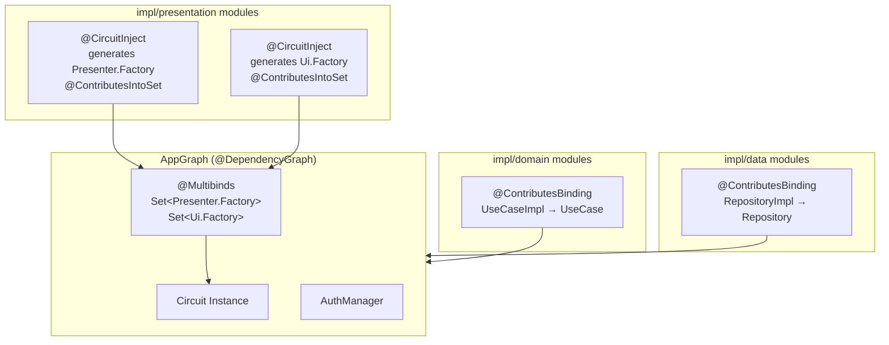
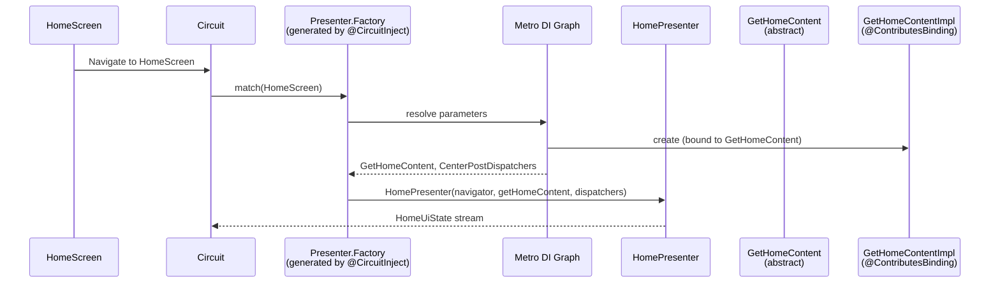

# Dependency Injection Reference

> Companion: [centerpost.md](centerpost.md) — covers how presenters consume the use cases that Metro injects (the consumer side of every binding documented here).

## Metro DI Overview

Metro is an Anvil-compatible, compile-time dependency injection framework. It generates the DI graph at compile time with no runtime reflection. KSP is used for code generation but Metro itself does not require separate KSP configuration -- the convention plugins handle this.

Metro is enabled by:
- `mockdonalds.kmp.domain` plugin (for impl/domain modules)
- `mockdonalds.kmp.data` plugin (for impl/data modules)
- `mockdonalds.kmp.presentation` plugin (for impl/presentation modules, with `enableCircuitCodegen.set(true)`)

## @ContributesBinding(AppScope::class)

Applied to ALL implementation classes that fulfill an interface or abstract class contract:

```kotlin
@ContributesBinding(AppScope::class)
class GetHomeContentImpl(
    private val repository: HomeRepository,
) : GetHomeContent() { ... }

@ContributesBinding(AppScope::class)
class HomeRepositoryImpl : HomeRepository { ... }
```

Rules:
- Every `*Impl` class MUST have `@ContributesBinding(AppScope::class)`
- The class MUST extend an interface or abstract class (`DependencyInjectionTest` enforces this)
- The class must be `public` (default visibility) -- `internal` would hide it from Metro's cross-module resolution (`VisibilityConventionsTest`)
- Constructor parameters are automatically injected by Metro (implicit `@Inject`)

## @CircuitInject + @Inject -- Presenter and UI Wiring

Presenters and UI composables use Circuit's annotation-driven wiring:

```kotlin
@CircuitInject(HomeScreen::class, AppScope::class)
@Inject
@Composable
fun HomePresenter(
    navigator: Navigator,
    getHomeContent: GetHomeContent,
    dispatchers: CenterPostDispatchers,
): HomeUiState { ... }
```

Both `@CircuitInject` and `@Inject` are required on every presenter and UI function. `@CircuitInject` registers the function in Circuit's `Presenter.Factory`/`Ui.Factory` multibindings. `@Inject` enables Metro constructor injection for the function's parameters.

Enforced by `DependencyInjectionTest` ("all @CircuitInject presenters should also have @Inject").

## Circuit-Provided Parameters

Circuit and Metro automatically provide certain parameters -- do NOT inject these manually:

| Parameter | Source | Notes |
|-----------|--------|-------|
| `Screen` | Circuit | The screen instance that triggered this presenter |
| `Navigator` | Circuit | For navigation calls (`goTo`, `pop`, `resetRoot`) |
| `UiState` | Circuit | In UI functions, the state emitted by the presenter |
| `Modifier` | Circuit | In UI functions, the root modifier |

Everything else (use cases, dispatchers, services) must be provided via Metro DI. They appear as regular function parameters and Metro resolves them from the graph.

## The Presenter-to-Domain Contract

This is the most critical DI boundary in the architecture. Presenters communicate with the domain layer exclusively through CenterPost interactors:

**Allowed:**
- Inject abstract use cases from `api/domain` (e.g., `GetHomeContent`)
- Use `collectAsState()` to observe streaming data from interactors
- Use `rememberCenterPost(dispatchers)` for launching one-shot operations

**Forbidden (enforced by Konsist `PresentationLayerTest` and `ForbiddenPatternsTest`):**
- Inject Repository interfaces -- only interactors
- Import from `impl/domain` or `impl/data`
- Construct api domain models directly in the presenter
- Use raw `CoroutineScope`, `launch`, `async` -- use `rememberCenterPost()` from `core:centerpost`
- Use hardcoded `Dispatchers.*` -- use `CenterPostDispatchers` (injected)

## AppGraph / DependencyGraph(AppScope)



```
┌──────────────────────────────────────────────────────────┐
│                  ProdAppGraph (composeApp)                │
│         @DependencyGraph(AppScope::class)                │
│                                                          │
│  Aggregates all contributed bindings from:               │
│  ┌──────────┐  ┌──────────┐  ┌──────────────────────┐   │
│  │impl/domain│  │impl/data │  │  impl/presentation   │   │
│  │ modules   │  │ modules  │  │     modules          │   │
│  │           │  │          │  │                      │   │
│  │@Contributes│ │@Contributes│ │ @CircuitInject       │   │
│  │Binding    │  │Binding   │  │ generates factories  │   │
│  │UseCase→If │  │Repo→If   │  │ @ContributesIntoSet  │   │
│  └──────────┘  └──────────┘  └──────────────────────┘   │
│                                                          │
│  Circuit.Builder()                                       │
│    .addPresenterFactories(presenterFactories)            │
│    .addUiFactories(uiFactories)                          │
│    .build()                                              │
└──────────────────────────────────────────────────────────┘
```

### DI Resolution Flow



The DI graph is split across three modules:

**`core/circuit/CircuitProviders.kt`** — aggregates Circuit factories:
```kotlin
@ContributesTo(AppScope::class)
interface CircuitProviders {
    @Multibinds fun presenterFactories(): Set<Presenter.Factory>
    @Multibinds(allowEmpty = true) fun uiFactories(): Set<Ui.Factory>

    @Provides @SingleIn(AppScope::class)
    fun provideCircuit(
        presenterFactories: Set<Presenter.Factory>,
        uiFactories: Set<Ui.Factory>,
    ): Circuit { ... }
}
```

**`core/metro/AppGraph.kt`** — shared graph contract (annotation-free):
```kotlin
interface AppGraph {
    val circuit: Circuit
    val authManager: AuthManager
}
```

**`composeApp/AppGraph.kt`** — production graph:
```kotlin
@DependencyGraph(AppScope::class)
interface ProdAppGraph : AppGraph
```

- `@DependencyGraph(AppScope::class)` on `ProdAppGraph` marks it as the root graph
- `@ContributesTo(AppScope::class)` on `CircuitProviders` merges it into the graph
- `@Multibinds` collects all `Presenter.Factory` and `Ui.Factory` instances contributed by `@CircuitInject` across all feature modules
- Every `@ContributesBinding(AppScope::class)` class is automatically included in the graph

## Lazy<T> / Provider<T>

Metro supports deferred injection:
- `Provider<T>` -- new instance on each `.get()` call
- `Lazy<T>` -- cached after first access

Convention: use direct injection by default. Use `Provider<T>` only when the dependency is conditionally needed (e.g., only created on a specific user action). Use `Lazy<T>` when initialization is expensive and may not be needed.

## Common DI Mistakes

| Mistake | Fix | Enforcement |
|---------|-----|-------------|
| Missing `@Inject` on `@CircuitInject` function | Add `@Inject` -- Metro needs it for parameter resolution | `DependencyInjectionTest` |
| `@ContributesBinding` class doesn't extend anything | Must extend the interface/abstract class it binds to | `DependencyInjectionTest` |
| Repository interface without `@ContributesBinding` impl | Create `{Name}RepositoryImpl` with `@ContributesBinding` | `DependencyInjectionTest` |
| Abstract use case without `@ContributesBinding` impl | Create `{Name}Impl` with `@ContributesBinding` | `DependencyInjectionTest` |
| Making `@ContributesBinding` class `internal` | Must be `public` for cross-module Metro resolution | `VisibilityConventionsTest` |
| Presenter injecting Repository directly | Inject the abstract use case from api/domain instead | `PresentationLayerTest` |

## Complete Annotated Example

Full chain from Screen to Repository:

```kotlin
// 1. Screen -- api/navigation (public contract, singleton)
@Parcelize
data object HomeScreen : TabScreen {
    override val tag: String = "home"
}

// 2. Abstract Use Case -- api/domain (public contract)
abstract class GetHomeContent : CenterPostSubjectInteractor<Unit, HomeContent>()

// 3. Use Case Impl -- impl/domain (binds to abstract via DI)
@ContributesBinding(AppScope::class)
class GetHomeContentImpl(
    private val repository: HomeRepository,  // injected by Metro
) : GetHomeContent() {
    override fun createObservable(params: Unit): Flow<HomeContent> {
        return combine(
            repository.getUserName(),
            repository.getHeroPromotion(),
            repository.getRecentCravings(),
            repository.getExploreItems(),
        ) { userName, hero, cravings, explore ->
            HomeContent(userName = userName, heroPromotion = hero,
                        recentCravings = cravings, exploreItems = explore)
        }
    }
}

// 4. Repository Interface -- impl/domain (domain boundary)
interface HomeRepository {
    fun getUserName(): Flow<String>
    fun getHeroPromotion(): Flow<HeroPromotion>
    fun getRecentCravings(): Flow<List<Craving>>
    fun getExploreItems(): Flow<List<ExploreItem>>
}

// 5. Repository Impl -- impl/data (binds to interface via DI)
@ContributesBinding(AppScope::class)
class HomeRepositoryImpl : HomeRepository {
    override fun getUserName(): Flow<String> = flowOf("Alex Mercer")
    // ... other overrides
}

// 6. Presenter -- impl/presentation (injected by Circuit + Metro)
@CircuitInject(HomeScreen::class, AppScope::class)
@Inject
@Composable
fun HomePresenter(
    navigator: Navigator,              // Circuit-provided
    getHomeContent: GetHomeContent,    // Metro-injected (resolves to GetHomeContentImpl)
    dispatchers: CenterPostDispatchers, // Metro-injected from core:centerpost
): HomeUiState {
    val centerPost = rememberCenterPost(dispatchers)
    val content by getHomeContent.collectAsState()
    return HomeUiState(
        userName = content?.userName ?: "",
        eventSink = { event -> when (event) { ... } },
    )
}
```

The DI graph assembles this automatically: `ProdAppGraph` creates `Circuit` from multibindings, Circuit matches `HomeScreen` to `HomePresenter` via `@CircuitInject`, Metro resolves `GetHomeContent` to `GetHomeContentImpl` via `@ContributesBinding`, and `HomeRepository` to `HomeRepositoryImpl` the same way.
